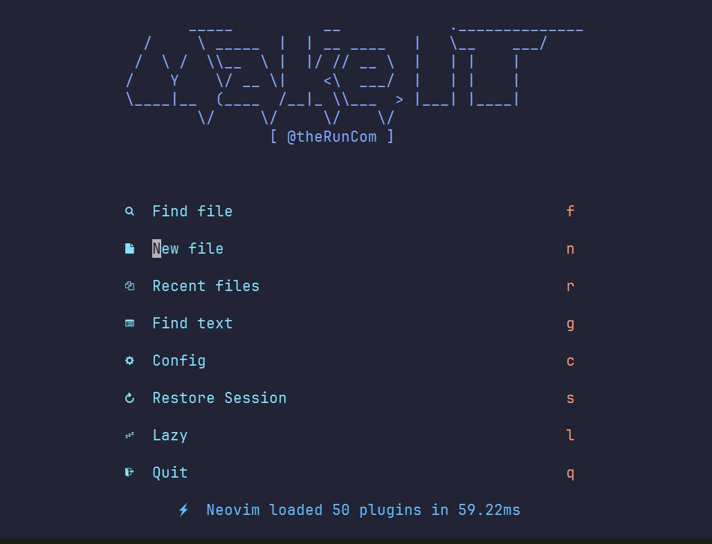

# MasterLazyVim 🏄

## LazyVim🤔

[LazyVim官方网站](https://www.lazyvim.org/)

LazyVim是一套Neovim配置，由lazy.nvim驱动，可以轻松自定义和扩展您的配置。LazyVim提供了两全其美的方式 - 根据需要调整配置的灵活性，以及默认预配置的便利性。它可以将您的Neovim转换为一个完整的IDE，具有易于自定义和扩展的配置，以及合理的默认设置。LazyVim还提供了许多预配置的插件，可立即使用!


LazyVim 的出现可以说是将主流 IDE 和 Vim 的优点有机地结合在一起，使得它既具备强大的编辑和编程功能，同时也具备交互体验和开发效率。因此，使用 LazyVim 可以让你更加高效地完成编程工作，并且能够享受使用 Vim 带来的编辑效率和快乐。

## ⌨️ 快捷键

[KeyMaps](https://www.lazyvim.org/keymaps)

[vim命令使用总结](https://www.bilibili.com/read/cv22398023)

## ⚙️ 相关配置

### 1. 添加插件

在 .config/nvim/lua/plugins/ 新加 xxx.lua，格式参考 example.lua

- 修改主题，tokyonight.lua:

    ```lua
    return {
    {
        "folke/tokyonight.nvim",
        lazy = true,
        opts = {
        colorscheme = "tokyonight",
        style = "storm",
        },
    },
    } 
    ```

- 更改开始面板logo，alpha.lua:

    ```lua
    return {
        "goolord/alpha-nvim",
        opts = function(_, opts)
            local logo = [[
            _____          __            .______________
        /     \ _____  |  | __ ____   |   \__    ___/
        /  \ /  \\__  \ |  |/ // __ \  |   | |    |   
        /    Y    \/ __ \|    <\  ___/  |   | |    |   
        \____|__  (____  /__|_ \\___  > |___| |____|   
                \/     \/     \/    \/                 
                       [ @theRunCom ]
            ]]
            opts.section.header.val = vim.split(logo, "\n", { trimempty = true })
        end,
    }
    ```



- 浏览文件，file-browser.lua:

    ```lua
    return {
        "nvim-telescope/telescope-file-browser.nvim",
        keys = {
            {
            "<leader>sB",
            ":Telescope file_browser path=%:p:h=%:p:h<cr>",
            desc = "Browse Files",
            },
        },
        config = function()
            require("telescope").load_extension("file_browser")
        end,
    }
    ```


- 终端，toggleterm.lua:

    ```lua
    return {
    {
        "akinsho/toggleterm.nvim",
        version = "*",
        opts = {
        size = 20,
        open_mapping = [[<c-\>]],
        hide_numbers = true,
        shade_terminals = true,
        shading_factor = 2,
        start_in_insert = true,
        insert_mappings = true,
        persist_size = true,
        direction = "float",
        close_on_exit = true,
        shell = vim.o.shell,
        float_opts = {
            border = "curved",
        },
        },
        keys = {
        {
            "<c-\\>",
            desc = "Toggle term",
        },
        },
    },
    }
    ```

- tree-sitter插件是基于tree-sitter的插件，可以为多种编辑器提供语法高亮、代码折叠、自动补全等功能，treesitter.lua:

```lua
return {
  {
    "nvim-treesitter/nvim-treesitter",
    opts = {
      ensure_installed = {
        "bash",
        "regex",
        "vim",
        "lua",
        "html",
        "markdown",
        "markdown_inline",
        "css",
        "typescript",
        "tsx",
        "javascript",
        "json",
        "json5",
        "jsonc",
        "graphql",
        "prisma",
        "rust",
        "go",
        "toml",
        "c",
        "cpp",
        "clojure",
        "dart",
        "dockerfile",
        "scss",
        "swift",
        "toml",
        "verilog",
        "vue",
        "zig",
        "proto",
        "svelte",
        "solidity",
      },
      auto_install = true,
      -- ensure_installed = "all", -- one of "all" or a list of languages
      ignore_install = { "" }, -- List of parsers to ignore installing
      sync_install = false, -- install languages synchronously (only applied to `ensure_installed`)

      highlight = {
        enable = true, -- false will disable the whole extension
        disable = { "css" }, -- list of language that will be disabled
      },
      autopairs = {
        enable = true,
      },
      indent = { enable = true, disable = { "python", "css" } },

      context_commentstring = {
        enable = true,
        enable_autocmd = false,
      },
    },
  },
}

```

- Tailwind CSS 相关支持，tailwind.lua:

    ```lua
    return {
    {
        "neovim/nvim-lspconfig",
        opts = {
        servers = {
            tailwindcss = {},
        },
        },
    },
    {
        "NvChad/nvim-colorizer.lua",
        opts = {
        user_default_options = {
            tailwind = true,
        },
        },
    },
    {
        "hrsh7th/nvim-cmp",
        dependencies = {
        { "roobert/tailwindcss-colorizer-cmp.nvim", config = true },
        },
        opts = function(_, opts)
        -- original LazyVim kind icon formatter
        local format_kinds = opts.formatting.format
        opts.formatting.format = function(entry, item)
            format_kinds(entry, item) -- add icons
            return require("tailwindcss-colorizer-cmp").formatter(entry, item)
        end
        end,
    },
    }
    ```

## Tips🔐

[vim原生快捷键](https://devhints.io/vim)

## 步骤

1. 运行`:checkhealth`

 

0:00 Introduction
0:24 LazyVim Installation
1:35 Show which-key
2:11 Add TypeScript Support 
3:10 Find Files via Telescope
3:38 Leap.nvim Plugin
3:55 LSP Features
4:14 Search Grep via Telescope
4:32 Diagnostics
5:02 Colorscheme Picker
5:12 Switch Buffers
5:39 Splits
6:05 Todo Plugin
6:40 Autocompletion and Snippets
7:40 Find Keymaps
7:52 Lazy.nvim Plugin
8:34 Toggle Numbers
8:45 Global Search Replace
9:34 Lazygit Plugin
9:58 Terminal Plugin
10:49 Add Custom Option
11:30 Add Custom Keymap
12:46 Switch Default Colorscheme
13:59 Add New Plugin
15:11 Update Built-in Plugin
15:58 Disable Built-in Plugin
16:36 Conclusion